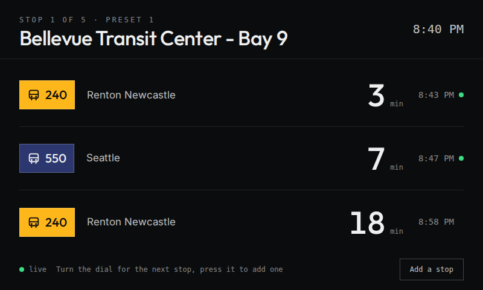
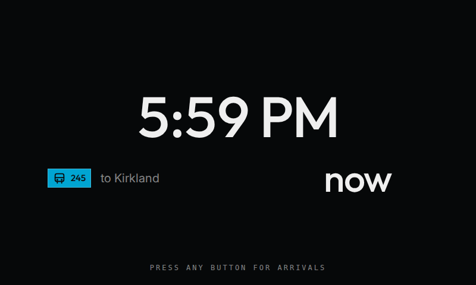
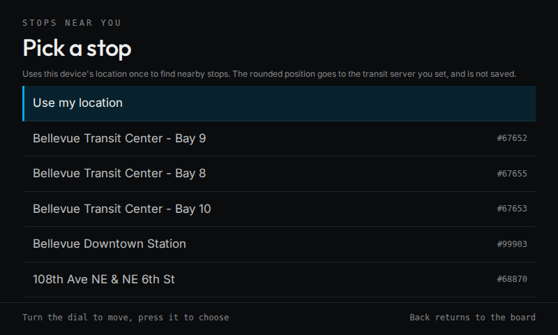

# Transit Thing

Next bus, train, and ferry departures on a Spotify Car Thing running
[bridgething](https://bridgething.com). An arrivals board for your desk that
also works in the car.

| Board | Ambient | Nearby stops |
| --- | --- | --- |
|  |  |  |

## What it does

- Shows the next departures for the stops you save, with a countdown, the
  scheduled time, and a live marker when the agency sends real-time data.
- Turn the dial to move between stops. Presets 1 to 4 jump to your first four.
- Press the dial or tap **Find nearby stops** to pick a stop from the ones
  around you, then choose which routes to show.
- Shows a clock when nothing is due, and comes back when something is.

Data comes from a [Transit Tracker API](https://github.com/tjhorner/transit-tracker-api)
server. The default is TJ Horner's public instance at `tt.horner.tj`, which
serves 41 agencies across North America and Europe, including all of Puget
Sound. You can point the app at your own server in its settings.

## Install

1. In the bridgething companion app, open the store and add this source:

   ```
   https://sparkyfen.github.io/transit-thing/catalog.v1.json
   ```

2. Install **Transit Thing**.
3. Open its settings to pick a feed and a server, or pick stops on the device.

The app reads this device's location only when you ask for nearby stops. The
position stays on the device and is used once to sort the list.

## Develop

```sh
bun install
bun run dev            # against a Car Thing connected over USB
bun run dev:device     # the same, shown on the Car Thing screen
bun run test           # unit tests
bun run check          # typecheck, build, and validate the catalog
```

The app lives in `apps/transit-thing`. Pushing to `main` publishes the catalog
to GitHub Pages.

## Credits

- [Transit Tracker](https://transit-tracker.eastsideurbanism.org/) and its API
  by TJ Horner and Eastside Urbanism.
- [bridgething](https://bridgething.com) by Joey Eamigh.

## License

MIT. See [LICENSE](LICENSE).
